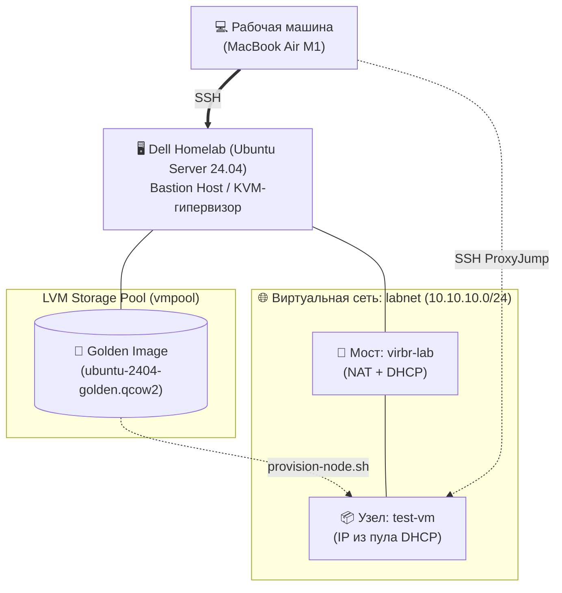

# infra_foundation — Базовая инфраструктура небольшого сервиса

> С «голого» ноутбука до укреплённого парка Linux-узлов (ВМ) с живым сервисом за прокси.

**Стек:** Ubuntu Server 24.04 · KVM/QEMU · libvirt · cloud-init · LVM · systemd · Bash

## Проблема

Есть «голый» ноутбук — нужно развернуть рабочую инфраструктуру для небольшой компании: гипервизор, парк из трёх-четырёх виртуальных узлов, внутренняя сеть с разрешением имён, аккуратная модель доступа по SSH и живой рабочий сервис за обратным прокси.

## Решение

Один физический узел превращается в гипервизор на KVM/libvirt, и на нём поднимается парк ВМ, имитирующий прод-подобную площадку: web (Nginx как reverse proxy с TLS), app (готовый OSS-сервис Gitea вместе с базой PostgreSQL) и mgmt (управляющий узел — внутренний DNS). Каждый узел приводится в соответствие с нормами эксплуатации: пользователи и sudo, доступ строго по SSH-ключам, службы под systemd, пакеты и репозитории, разметка и LVM, файрвол, статическая адресация и внутренние имена. На площадке разворачивается настоящий сервис с базой за прокси — чтобы было что наблюдать, чинить и разбирать, а не абстрактная «нагрузка».

## Результат

Проект собирается по шагам; отмеченное уже работает и воспроизводится из этого репозитория.

- [x] Хост-гипервизор: KVM/libvirt на Ubuntu 24.04, хранилище ВМ на LVM
- [x] Доступ только по SSH-ключу — парольный вход и root-логин отключены
- [x] План адресации парка зафиксирован — [`docs/addressing.md`](docs/addressing.md)
- [x] Внутренняя сеть `labnet` (10.10.10.0/24) с NAT наружу поднята в libvirt
- [x] Golden image Ubuntu 24.04 — обезличенный шаблон с cloud-init (пользователь, SSH-ключ, qemu-guest-agent)
- [x] Новый узел парка поднимается из шаблона одной командой — [`scripts/provision-node.sh`](scripts/provision-node.sh)
- [ ] Парк из 3+ ВМ в сегменте 10.10.10.0/24 со статической адресацией
- [ ] Внутренний DNS: `dig app.lab.internal` резолвит узлы по именам
- [ ] Gitea на PostgreSQL, доступна по `https://gitea.lab.internal` через Nginx с TLS
- [ ] Узлы прикрыты файрволом — открыты только нужные порты

## Архитектура



**Сетевая топология:**
Поднята изолированная виртуальная внутренняя сеть `10.10.10.0/24` на libvirt с настроенным NAT для выхода узлов в интернет. За каждым узлом закрепляется его статический адрес. Полная карта адресации описана в [`docs/addressing.md`](docs/addressing.md).

**Автоматизация (Golden Image):**
Узлы парка не устанавливаются вручную. Подготовлен обезличенный «золотой шаблон» на базе Ubuntu 24.04. Новые ВМ клонируются из него, а базовая конфигурация (пользователи, ключи) инжектится через **cloud-init**.

## Как воспроизвести

Развёртывание разбито на этапы; каждый следующий опирается на результат предыдущего. Требования к площадке, порядок этапов и сами инструкции — в [`docs/deploy/`](docs/deploy/README.md).

| Этап | Что получаем |
| --- | --- |
| [1. Гипервизор](docs/deploy/01-hypervisor.md) | KVM/libvirt на узле-гипервизоре и хранилище дисков ВМ на LVM |
| [2. Сеть парка](docs/deploy/02-network.md) | изолированная сеть `labnet` 10.10.10.0/24 с NAT наружу |
| [3. Golden image](docs/deploy/03-golden-image.md) | обезличенный шаблон Ubuntu 24.04 с cloud-init |
| [4. Развёртывание узла](docs/deploy/04-node-provisioning.md) | узел парка из шаблона одной командой |
| [5. Внутренний DNS](docs/deploy/05-internal-dns.md) | зона `lab.internal` на dnsmasq узла mgmt |

## Что ломалось и как чинил

### SSH: настройка не применялась (задача 1)

Не применялась настройка `PasswordAuthentication no` в sshd_config: файл `50-cloud-init.conf` перебивал её своей по правилу «первого совпадения». Посмотрел через `sshd -T`, какие настройки попадают в итоговый конфиг, и нашёл источник через `grep` по `/etc/ssh/sshd_config` и `/etc/ssh/sshd_config.d/`. Добавил свой конфиг drop-in'ом `01-hardening.conf` — он читается раньше остальных.

### Обезличивание golden image: снёс структуру /var/log (задача 2)

**Суть проблемы**

При обезличивании golden image нужно обнулить содержимое системных логов. Я выбрал неверный способ — удалил и файлы, и каталоги: `rm -rf /var/log/*`. Без каталога `/var/log/journal` служба `journald` начинает писать журнал в оперативную память: после перезагрузки все накопленные записи исчезают, и узнать, что происходило с системой до ребута, уже нельзя. Проблему я заметил при офлайн-проверке образа через libguestfs-tools, когда ВМ была уже обезличена и выключена, — а снова запустить её, чтобы система восстановила структуру `/var/log`, нельзя: при старте заново сгенерируется ровно то, что мы вычистили на прошлых шагах (machine-id, host-ключи SSH).

**Правильное решение**

Структуру `/var/log` удалять не нужно — достаточно обнулить содержимое файлов логов до нуля байт. Итоговый вариант — в разделе [Обезличивание ВМ в golden image](docs/deploy/03-golden-image.md#обезличивание-вм-в-golden-image).

**Как исправлял**

Образ выключен, и запускать его нельзя. Для правки использовал набор утилит `libguestfs-tools`: они позволяют менять содержимое виртуального диска, не запуская саму ВМ. Под капотом поднимается минималистичное ядро Linux, которое монтирует образ диска и даёт доступ к его файловой системе; следов внутри гостевой системы такая правка не оставляет.

Установка инструментов:

```bash
sudo apt update
sudo apt install -y libguestfs-tools
```

Починка структуры `/var/log` — вносим изменения в образ офлайн:

```bash
# Разрешаем запись в образ (сейчас он read-only)
sudo chmod 644 /var/lib/libvirt/vmpool/ubuntu-2404-golden.qcow2

# Восстанавливаем каталог journal и пустые файлы wtmp/btmp
sudo virt-customize -a /var/lib/libvirt/vmpool/ubuntu-2404-golden.qcow2 \
    --mkdir /var/log/journal \
    --touch /var/log/wtmp \
    --touch /var/log/btmp

# Возвращаем защиту от случайной записи
sudo chmod 444 /var/lib/libvirt/vmpool/ubuntu-2404-golden.qcow2

# Убеждаемся, что починка удалась
sudo virt-ls -a /var/lib/libvirt/vmpool/ubuntu-2404-golden.qcow2 /var/log/ | egrep 'journal|wtmp|btmp'
```

В выводе должны появиться все три имени. При этом ВМ всё время оставалась выключенной — «чистота» golden image не нарушилась.

### Отказ qemu-guest-agent: гипервизор потерял канал к ВМ (смоделированная поломка, задача 2)

**Суть**

Состояние стенда: сеть настроена, golden image подготовлен, клонирование узлов скриптом работает, в libvirt поднят один тестовый узел. Поломку я вносил вслепую: команда пришла в base64 с описанием эффекта, но без разбора — «меняет две вещи у одного systemd-юнита, ничего не удаляет, SSH и сеть не трогает».

Воспроизвести поломку внутри ВМ:

```bash
echo 'c3VkbyBzeXN0ZW1jdGwgc3RvcCBxZW11LWd1ZXN0LWFnZW50ICYmIHN1ZG8gc3lzdGVtY3RsIG1hc2sgcWVtdS1ndWVzdC1hZ2VudA==' | base64 -d | bash
```

**Симптом**

Смотрю список ВМ — узел на месте и в статусе `running`:

```bash
virsh list --all
```

Чтобы попасть на машину по SSH, спрашиваю её адрес у гостевого агента:

```bash
virsh domifaddr test-vm --source agent
```

Получаю ошибку:

```text
error: Failed to query for interfaces addresses
error: Guest agent is not responding: QEMU guest agent is not connected
```

**Куда смотрю и почему**

Первым делом надо развести две разные аварии: «ВМ не получила адрес, проблема в сети» и «мёртв только канал до агента». Для этого спрашиваю адрес у другого источника — из файла аренд DHCP, который libvirt ведёт на стороне гипервизора и который про гостевого агента ничего не знает:

```bash
virsh domifaddr test-vm --source lease
```

Адрес узлу выдан:

```text
 Name       MAC address          Protocol     Address
-------------------------------------------------------------------------------
 vnet1      52:54:00:00:37:df    ipv4         10.10.10.199/24
```

**Гипотеза**

Агент не отвечает, но ВМ запущена и адрес в виртуальной сети получила — значит, проблема в самом демоне `qemu-guest-agent`, а не в сети и не в ВМ целиком.

**Чем проверяю**

Адрес известен — подключаюсь по SSH и смотрю статус демона:

```bash
systemctl status qemu-guest-agent
```

```text
○ qemu-guest-agent.service
     Loaded: masked (Reason: Unit qemu-guest-agent.service is masked.)
     Active: inactive (dead) since Wed 2026-08-12 10:07:20 UTC; 1h 7min ago
   Duration: 22h 58min 12.575s
   Main PID: 5944 (code=exited, status=0/SUCCESS)
        CPU: 24ms
```

Служба в состоянии `masked` — полностью заблокирована. Снимаю блокировку:

```bash
sudo systemctl unmask qemu-guest-agent
```

```text
Removed "/etc/systemd/system/qemu-guest-agent.service".
```

Блокировка снята, но служба по-прежнему неактивна:

```text
Loaded: loaded (/usr/lib/systemd/system/qemu-guest-agent.service; static)
```

Здесь нюанс: `static` означает, что у юнита нет секции `[Install]` — в нём не описано, при каком условии система должна его стартовать. Значит, добавлять службу в автозагрузку через `enable` не нужно (и не получится): при старте ВМ её поднимает менеджер устройств `udev`, когда видит проброшенный из гипервизора виртуальный канал. В госте этот канал выглядит как файл устройства `/dev/virtio-ports/org.qemu.guest_agent.0` — тот самый `--channel`, который мы передавали `virt-install`. Поэтому достаточно просто запустить службу:

```bash
sudo systemctl start qemu-guest-agent
```

```text
Active: active (running) since Wed 2026-08-12 11:25:26 UTC; 36s ago
```

Проверяю исходный симптом — снова спрашиваю адрес через агента:

```bash
virsh domifaddr test-vm --source agent
```

```text
 Name       MAC address          Protocol     Address
-------------------------------------------------------------------------------
 lo         00:00:00:00:00:00    ipv4         127.0.0.1/8
 -          -                    ipv6         ::1/128
 enp1s0     52:54:00:00:37:df    ipv4         10.10.10.199/24
 -          -                    ipv6         fe80::5054:ff:fe00:37df/64
```


## Карта репозитория

```text
.
├── docs/
│   ├── addressing.md          # план адресации парка: CIDR, таблица узлов и имён
│   ├── access-model.md        # модель SSH-доступа: ProxyJump, ключи, known_hosts
│   └── deploy/                # пошаговое воспроизведение по этапам
├── configs/
│   ├── host/                  # libvirt: сеть и storage pool, sshd_config гипервизора
│   ├── cloud-init/            # шаблоны user-data и network-config для узлов парка
│   └── dnsmasq/               # зона lab.internal на узле mgmt
└── scripts/
    └── provision-node.sh      # развёртывание узла парка из golden image
```
