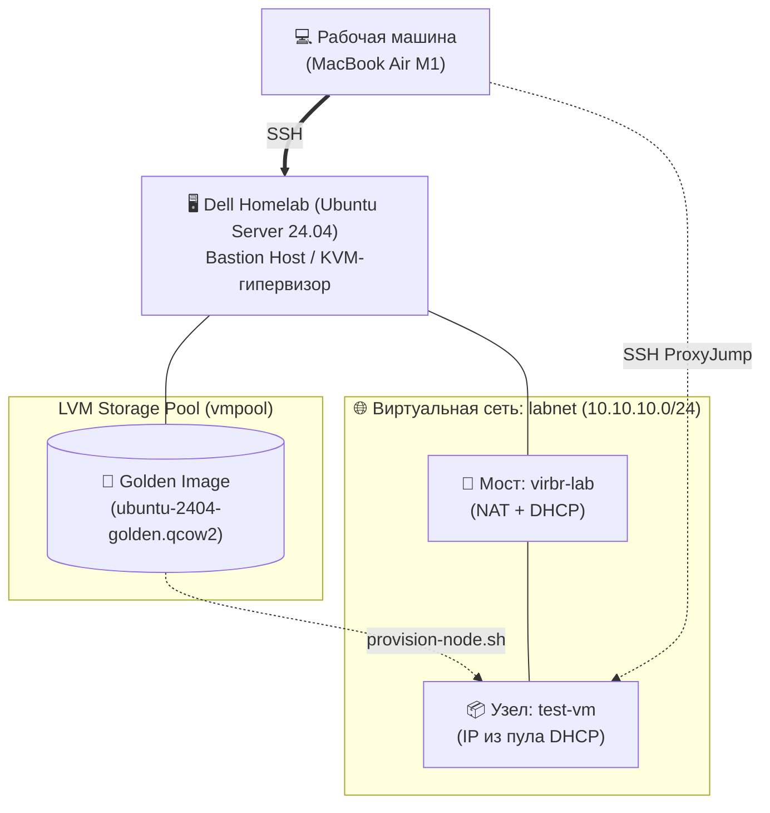

# infra_foundation — Базовая инфраструктура небольшого сервиса

> С «голого» ноутбука до укреплённого парка Linux-узлов (ВМ) с живым сервисом за прокси.

**Стек:** Ubuntu Server 24.04 · KVM/QEMU · libvirt · cloud-init · LVM · systemd · Bash

## Проблема

Есть «голый» ноутбук — нужно развернуть рабочую инфраструктуру для небольшой компании: гипервизор, парк из трёх-четырёх виртуальных узлов, внутренняя сеть с разрешением имён, аккуратная модель доступа по SSH и живой рабочий сервис за обратным прокси.

## Решение

Один физический узел превращается в гипервизор на KVM/libvirt, и на нём поднимается парк ВМ, имитирующий прод-подобную площадку: web (Nginx как reverse proxy с TLS), app (готовый OSS-сервис Gitea вместе с базой PostgreSQL) и mgmt (управляющий узел — внутренний DNS). Каждый узел приводится в соответствие с нормами эксплуатации: пользователи и sudo, доступ строго по SSH-ключам, службы под systemd, пакеты и репозитории, разметка и LVM, файрвол, статическая адресация и внутренние имена. На площадке разворачивается настоящий сервис с базой за прокси — чтобы было что наблюдать, чинить и разбирать, а не абстрактная «нагрузка».

## Результат

Проект собирается по шагам; отмеченное уже работает и воспроизводится из этого репозитория.

- [x] Хост-гипервизор: KVM/libvirt на Ubuntu 24.04, хранилище ВМ на LVM
- [x] Доступ только по SSH-ключу — парольный вход и root-логин отключены
- [x] План адресации парка зафиксирован — [`docs/addressing.md`](docs/addressing.md)
- [x] Внутренняя сеть `labnet` (10.10.10.0/24) с NAT наружу поднята в libvirt
- [x] Golden image Ubuntu 24.04 — обезличенный шаблон с cloud-init (пользователь, SSH-ключ, qemu-guest-agent)
- [x] Новый узел парка поднимается из шаблона одной командой — [`scripts/provision-node.sh`](scripts/provision-node.sh)
- [ ] Парк из 3+ ВМ в сегменте 10.10.10.0/24 со статической адресацией
- [ ] Внутренний DNS: `dig app.lab.internal` резолвит узлы по именам
- [ ] Gitea на PostgreSQL, доступна по `https://gitea.lab.internal` через Nginx с TLS
- [ ] Узлы прикрыты файрволом — открыты только нужные порты

## Архитектура



**Сетевая топология:**
Поднята изолированная виртуальная внутренняя сеть `10.10.10.0/24` на libvirt с настроенным NAT для выхода узлов в интернет. За каждым узлом закрепляется его статический адрес. Полная карта адресации описана в [`docs/addressing.md`](docs/addressing.md).

**Автоматизация (Golden Image):**
Узлы парка не устанавливаются вручную. Подготовлен обезличенный «золотой шаблон» на базе Ubuntu 24.04. Новые ВМ клонируются из него, а базовая конфигурация (пользователи, ключи) инжектится через **cloud-init**.

## Как воспроизвести

Развёртывание узлов автоматизировано: инфраструктура поднимается в несколько шагов, без ручной настройки каждой ВМ.

### 0. Подготовка перед развёртыванием

#### 0.1 Требования

- настроено SSH-соединение с рабочей машины до узла-гипервизора (вход по ключу);
- публичный ключ рабочей машины лежит на гипервизоре **отдельным файлом** — по умолчанию `~/.ssh/client_mac_key.pub`;
- на узле-гипервизоре развёрнута Ubuntu Server 24.04;
- узел поддерживает аппаратную виртуализацию — проверяем:

```bash
egrep -c '(vmx|svm)' /proc/cpuinfo   # результат > 0 — поддержка есть
```

Про второй пункт: этот файл — не то же самое, что настроенный вход на гипервизор. Ключ из него cloud-init кладёт в `authorized_keys` каждого узла парка, и это должен быть ключ **рабочей машины**, а не гипервизора. Причина в том, как работает ProxyJump: гипервизор не «перекидывает» пользователя дальше своей сессией, он лишь прокидывает TCP-соединение, а SSH-сессию с узлом парка устанавливает и аутентифицирует сам клиент, сквозь этот туннель. Положишь в шаблон ключ гипервизора — с рабочей машины на узлы не зайдёшь.

#### 0.2 Склонировать репозиторий на узел-гипервизор

```bash
cd ~
git clone https://github.com/ArtemKravets/infra_foundation.git
cd infra_foundation
```

### 1. Установка KVM/libvirt

Ставим на предполагаемый гипервизор пакеты для работы с виртуализацией.

```bash
# Устанавливаем пакеты
sudo apt install -y qemu-kvm libvirt-daemon-system libvirt-clients virtinst bridge-utils iputils-arping

# Даём своему пользователю доступ к KVM/libvirt без sudo
sudo usermod -aG libvirt,kvm $USER
```

Перезаходим в новую сессию — добавленные группы не подхватываются в текущей:

```bash
exit
ssh hypervisor   # подставь свой алиас или адрес гипервизора
groups           # в списке должны появиться libvirt и kvm
```

Проверяем, что служба `libvirtd` запустилась, и фиксируем системное подключение libvirt:

```bash
sudo systemctl enable --now libvirtd   # будим службу и ставим её на автозапуск при загрузке ОС
systemctl is-active libvirtd           # ожидаем active
lsmod | grep kvm                       # проверяем, что модуль KVM подхвачен ядром

# Без явного URI virsh от обычного пользователя идёт в qemu:///session — отдельный
# «пользовательский» гипервизор, где нет ни нашего пула, ни сети, ни ВМ.
# Фиксируем системное подключение, чтобы дальнейшие команды работали как написано.
export LIBVIRT_DEFAULT_URI="qemu:///system"
echo 'export LIBVIRT_DEFAULT_URI="qemu:///system"' >> ~/.bashrc

virsh list --all                       # без sudo; пустой список с шапкой — норма
```

### 2. LVM storage pool под диски ВМ

#### 2.1 Подготовка системного хранилища

По умолчанию libvirt создаёт storage pool прямо на системном диске (в томе `ubuntu-lv`). В таком случае ВМ делят одно пространство с системным разделом — это небезопасно и плохо масштабируется. Поэтому определяем storage pool на LVM с типом `dir`: диски ВМ будут храниться на отдельном LV, примонтированном в каталог, в виде файлов `qcow2`. Концепция «диск как файл» позволяет легко и безопасно автоматизировать создание клонов от golden image.

Установщик Ubuntu по умолчанию создаёт VG (`ubuntu-vg`) и на нём корневой LV (`ubuntu-lv`). Как правило, на `ubuntu-vg` остаётся неиспользуемое пространство — им мы и воспользуемся: создадим LV, примонтируем его к каталогу и укажем `libvirt`, что там будет его storage pool.

Делаем диагностику хранилища, чтобы понять текущее состояние:

```bash
lsblk -f
sudo vgs
sudo lvs
sudo pvs
df -h /
```

Убеждаемся, что в системе присутствует VG `ubuntu-vg` со свободным местом (мы собираемся выделять 300G):

```text
VG        #PV #LV #SN Attr   VSize    VFree
ubuntu-vg   1   2   0 wz--n- <950.82g <550.82g
```

Создаём LV → накатываем ФС → монтируем к каталогу:

```bash
# 1. LV под образы ВМ
sudo lvcreate -L 300G -n libvirt-images ubuntu-vg

# 2. Файловая система
sudo mkfs.ext4 /dev/ubuntu-vg/libvirt-images

# 3. Точка монтирования
sudo mkdir -p /var/lib/libvirt/vmpool

# 4. Персистентный маунт по UUID
UUID=$(sudo blkid -s UUID -o value /dev/ubuntu-vg/libvirt-images)
echo "UUID=$UUID  /var/lib/libvirt/vmpool  ext4  defaults  0 2" | sudo tee -a /etc/fstab
sudo mount -a
df -h /var/lib/libvirt/vmpool   # должен показать монтирование нового LV
```

#### 2.2 Инициализация пула в libvirt

Используем готовое определение пула из файла [`configs/host/storage-pool.xml`](configs/host/storage-pool.xml). Указываем `libvirt`, что `/var/lib/libvirt/vmpool` становится его пулом.

```bash
# Определить, поднять и включить автозапуск пула
virsh pool-define configs/host/storage-pool.xml
virsh pool-start vmpool
virsh pool-autostart vmpool

# Проверяем, что пул определился в libvirt
virsh pool-list --all
```

### 3. Настройка виртуальной сети

Определяем и запускаем изолированную сеть для ВМ (её описание содержит настройки NAT и DHCP-пула):

```bash
virsh net-define configs/host/labnet.xml
virsh net-start labnet
virsh net-autostart labnet
```

- `net-define` — регистрирует сеть в libvirt на основе XML-манифеста.
- `net-start` — поднимает интерфейс сети: создаётся виртуальный мост `virbr-lab`, запускается экземпляр `dnsmasq` (на нём DHCP и разрешение имён). Создаются правила файрвола: маскарадинг для исходящего трафика и разрешение форварда.
- `net-autostart` — добавляет сеть в автозагрузку при старте хоста-гипервизора.

Проверяем, что сеть развернулась:

```bash
# labnet в состоянии active, autostart yes, persistent yes
virsh net-list --all

# 10.10.10.1/24 на интерфейсе
ip -br addr show virbr-lab

# Есть экземпляр dnsmasq, привязанный к мосту
ps aux | grep dnsmasq

# Файрвол разрешает ВМ выходить во внешнюю сеть — ищем в правилах 10.10.10.0/24
sudo nft list ruleset | grep -i masquerade
```

### 4. Доступ к узлам парка с рабочей машины

**Архитектура доступа: SSH ProxyJump (Bastion Host)**

Узлы парка находятся в изолированной сети labnet (10.10.10.0/24) за NAT. Домашняя сеть маршрута до этой подсети не имеет, поэтому прямое подключение невозможно.

Проблема решается использованием хоста-гипервизора в качестве Bastion Host. Гипервизор «видит» ВМ через виртуальный мост, что позволяет прозрачно пробрасывать SSH-трафик с рабочей машины домашней сети прямо на узлы парка с помощью ProxyJump.

Для бесшовного подключения достаточно добавить в `~/.ssh/config` на рабочей машине следующее правило:

```sshconfig
# Подключение к гипервизору (Bastion)
Host lab
    HostName <IP_гипервизора_в_LAN>
    User <твой_юзер>
    IdentityFile ~/.ssh/homelab_ed25519

# Прозрачное подключение к узлам парка через гипервизор
Host 10.10.10.*
    User devops
    UserKnownHostsFile ~/.ssh/known_hosts_lab
    StrictHostKeyChecking accept-new
    IdentityFile ~/.ssh/homelab_ed25519
    ProxyJump lab
```

**Отдельный known_hosts для узлов парка**

Клон, поднятый после удаления предыдущего, может получить из DHCP-пула уже использованный адрес. Клиент помнит публичный host-ключ старой ВМ, связанный с этим адресом, и начинает заваливать предупреждениями `REMOTE HOST IDENTIFICATION HAS CHANGED`. Поэтому для лабораторного диапазона заводим отдельный файл известных хостов (`UserKnownHostsFile ~/.ssh/known_hosts_lab` в правиле выше) — лабораторный шум не смешивается с боевым `~/.ssh/known_hosts`.

### 5. Подготовка базового образа (Golden Image)

#### 5.1 Установка cloud-образа и вспомогательных утилит

Скрипт развёртывания [`scripts/provision-node.sh`](scripts/provision-node.sh) ожидает подготовленный cloud-образ Ubuntu 24.04 (Noble Numbat). Такой образ уже приходит обезличенным и готовым к cloud-init: `/etc/machine-id` пуст, host-ключей нет, `/var/lib/cloud/` чистый. Несмотря на это, мы хотим подготовить его под себя — зафиксировать версии установленных пакетов. Тогда каждый клон из golden image получает предустановленный набор пакетов: это экономит время на развёртывании каждого узла и фиксирует начальное состояние системы.

Скачиваем cloud-образ и ставим утилиты для cloud-init:

```bash
# Даёт утилиту cloud-localds — ей будем собирать seed-образ с данными для cloud-init
sudo apt install -y cloud-image-utils

cd /var/lib/libvirt/vmpool
sudo curl -fLO https://cloud-images.ubuntu.com/noble/current/noble-server-cloudimg-amd64.img
sudo curl -fLO https://cloud-images.ubuntu.com/noble/current/SHA256SUMS
sha256sum --ignore-missing -c SHA256SUMS

# Обновляем информацию о пуле, чтобы libvirt увидел образ
virsh pool-refresh vmpool
virsh vol-list vmpool

# Проверяем формат образа — должны увидеть file format: qcow2
qemu-img info noble-server-cloudimg-amd64.img
```

#### 5.2 Подготовка для cloud-init

Cloud-образ при первой загрузке ищет `datasource` — источник данных о том, как себя настроить. Наш источник данных — ISO-образ из трёх файлов: `user-data` (как конфигурируем ОС: пользователи, права, SSH-ключи, правила обновления пакетов), `meta-data` (идентификация узла: instance-id, hostname) и `network-config` (конфигурация сетевого интерфейса, из которой cloud-init рендерит netplan). Собираем эти файлы в ISO утилитой `cloud-localds` и подключаем к ВМ вторым диском. `user-data` лежит в репозитории по пути [`configs/cloud-init/user-data.tmpl`](configs/cloud-init/user-data.tmpl) в виде шаблона, который ожидает подстановки публичного SSH-ключа для доступа к ВМ; `network-config` — по пути [`configs/cloud-init/network-config.tmpl`](configs/cloud-init/network-config.tmpl), он ожидает подстановки статического адреса узла и адреса DNS-сервера и применяется при развёртывании узлов парка (раздел 6). Golden image собираем без него: шаблон не должен нести адрес конкретного узла — на время сборки он получит адрес по DHCP. Из пакетов в `user-data` указан `qemu-guest-agent` — канал взаимодействия между гипервизором и гостем.

**Поднимаем ВМ**

Собираем всё необходимое для старта cloud-образа:

```bash
cd ~/infra_foundation

# Подставляем публичный SSH-ключ рабочей машины в шаблон и сохраняем готовый конфиг.
# envsubst читает переменную из окружения, поэтому её обязательно экспортировать.
export SSH_PUBKEY="$(cat ~/.ssh/client_mac_key.pub)"
envsubst '$SSH_PUBKEY' < configs/cloud-init/user-data.tmpl > /tmp/user-data

# Создаём meta-data
cat << 'EOF' > /tmp/meta-data
instance-id: template-01
local-hostname: ubuntu-template
EOF

# Увеличиваем виртуальный размер диска. При первой загрузке growpart и resize2fs
# (они входят в cloud-образ) сами растянут раздел и файловую систему под новый размер.
sudo qemu-img resize /var/lib/libvirt/vmpool/noble-server-cloudimg-amd64.img 10G

# Собираем seed-образ, который подключаем к ВМ как CD-ROM
cloud-localds \
    /tmp/seed.img \
    /tmp/user-data  \
    /tmp/meta-data
```

Разворачиваем ВМ, импортируя готовый диск и указывая настройки:

```bash
virt-install \
    --name golden-vm \
    --memory 1024 \
    --vcpus 1 \
    --disk path="/var/lib/libvirt/vmpool/noble-server-cloudimg-amd64.img",bus=virtio \
    --disk path="/tmp/seed.img",device=cdrom \
    --network network="labnet",model=virtio \
    --os-variant ubuntu24.04 \
    --import \
    --noautoconsole \
    --channel unix,target_type=virtio,name=org.qemu.guest_agent.0
```

- `memory`, `vcpus` — параметры «железа».
- `disk path` — cloud-образ и seed-образ в качестве дисков.
- `network` — название созданной виртуальной сети в libvirt.
- `channel` — канал общения гипервизора с ВМ.

Затем libvirt развернёт ВМ, и можно делать диагностику.

На гипервизоре:

```bash
# Покажет ВМ в состоянии running
virsh list

# Возвращает адрес — это одновременно доказывает, что qemu-guest-agent жив и виден гипервизору
virsh domifaddr golden-vm --source agent
```

Подключаемся по SSH к поднятой ВМ через ProxyJump на гипервизоре и делаем диагностику:

```bash
cloud-init status                      # status: done
id devops                              # показывает членство в sudo
sudo -n true                           # должен отработать молча
systemctl is-active qemu-guest-agent   # active
ping -c1 8.8.8.8                       # проходит во внешнюю сеть
ip -br a                               # показывает адрес из DHCP-пула .100–.200
df -h /                                # проверяем, что growpart отработал
```

#### 5.3 Обезличивание ВМ в golden image

Работающая система накапливает данные, которые однозначно её идентифицируют: machine-id, host-ключи SSH, отметку «cloud-init уже отработал», логи и кэши. Если разворачивать новые ВМ на базе такого «грязного» образа, все машины станут конфликтующими копиями: `cloud-init` не выполнит первичную инициализацию, DHCP начнёт выдавать одинаковые IP-адреса, а одинаковые SSH-ключи создадут дыру в безопасности.

Для обезличивания образа существует готовая утилита `virt-sysprep` — она вычищает уникальные данные автоматически. Но в рамках обучения выполним эти действия вручную.

Очищаем систему от уникальных данных, чтобы при инициализации они были сгенерированы заново, и устанавливаем обновления:

```bash
# Ставим актуальные пакеты и убираем неиспользуемые
sudo apt update && sudo apt -y upgrade
sudo apt -y autoremove --purge
sudo apt clean

# Сбрасываем состояние cloud-init
sudo cloud-init clean --logs --seed

# Удаляем host-ключи SSH текущей ВМ. При следующей загрузке будут сгенерированы новые.
sudo rm -f /etc/ssh/ssh_host_*

# Обнуляем размер файла, не удаляя его: systemd генерирует новый ID при загрузке
# именно по признаку «файл существует, но он пустой».
sudo truncate -s 0 /etc/machine-id

# Находим все файлы логов и обнуляем их содержимое, сохраняя структуру каталогов
# и права доступа. Это гарантирует, что службы вроде journald не сломаются при старте клона.
sudo find /var/log -type f -exec truncate -s 0 {} \;

# Удаляем файлы истории команд для пользователя и root
rm -f ~/.bash_history
sudo rm -f /root/.bash_history

# Очищаем буфер истории команд текущей сессии bash. Выполняется строго после удаления
# файлов, иначе при выходе из сессии bash запишет команды из RAM обратно в файл.
history -c

# Выключаем машину, чтобы система не сгенерировала новые данные в процессе работы
sudo poweroff
```

Почему логи именно обнуляются, а не удаляются вместе с каталогами — см. [Что ломалось и как чинил](#что-ломалось-и-как-чинил).

#### 5.4 Снять домен и зафиксировать образ как golden image

Сейчас поднятая ВМ `golden-vm` — это две сущности: XML-описание домена в libvirt и файл диска в пуле. Домен описывает полную конфигурацию ВМ: он указывает гипервизору, какие ресурсы выделить системе и как именно ими управлять. Файл диска — просто виртуальный накопитель с ОС. Для механизма клонирования нам нужен только подготовленный виртуальный диск, без домена: домен будет определять `virt-install` для каждой новой ВМ из скрипта `provision-node.sh`.

```bash
# Удаляет регистрацию виртуальной машины из libvirt
virsh undefine golden-vm

# Переименовывает оригинальный диск в осмысленное имя шаблона (golden image)
sudo mv /var/lib/libvirt/vmpool/noble-server-cloudimg-amd64.img /var/lib/libvirt/vmpool/ubuntu-2404-golden.qcow2

# Делает шаблон доступным только для чтения: ВМ, запущенная на этом образе, не сможет
# открыть его на запись и упадёт с ошибкой — так golden image защищён от «загрязнения».
sudo chmod 444 /var/lib/libvirt/vmpool/ubuntu-2404-golden.qcow2

virsh pool-refresh vmpool
```

Golden image готов.

### 6. Клонирование узла ВМ из Golden Image скриптом

Скрипт развёртывания [`scripts/provision-node.sh`](scripts/provision-node.sh) запускается так:

```text
./provision-node.sh <node_name> --ip <IP_ADDRESS> [--disk SIZE] [--ram MB] [--vcpu COUNT] [--dns DNS_IP]
```

Обязательные аргументы — имя узла и его статический IP-адрес; необязательные флаги задают параметры «железа» и адрес DNS-сервера. Что делает скрипт: проверяет переданные параметры и допустимость создания ВМ с ними (нет ли уже такого домена или диска, на месте ли шаблон и публичный ключ, не занят ли адрес в сети) → находит публичный SSH-ключ клиента → создаёт временный каталог, рендерит в него `user-data` и `network-config` (подставляя статический адрес узла и адрес DNS-сервера), генерирует уникальный `meta-data` и собирает из них seed-образ для cloud-init → делает клон golden image и при необходимости меняет размер диска → финальным шагом передаёт параметры ВМ в `virt-install` и поднимает её.

**Важно про передачу SSH-ключа скрипту**

По умолчанию скрипт ищет публичный ключ клиента по пути `~/.ssh/client_mac_key.pub`. Путь можно переопределить переменной `SSH_KEY_PATH` при вызове:

```bash
SSH_KEY_PATH=~/.ssh/my_key.pub scripts/provision-node.sh test-vm --ip 10.10.10.50
```

**Пример развёртывания из golden image**

```bash
scripts/provision-node.sh test-vm --ip 10.10.10.50

virsh list --all                         # видим test-vm в списке
virsh domifaddr test-vm --source agent   # видим статический адрес, переданный скрипту

# Подключаемся с клиента через ProxyJump — пускает по ключу, без пароля
ssh devops@10.10.10.50                   # адрес из вывода virsh domifaddr

# Внутри ВМ
cloud-init status   # done
ping -c1 8.8.8.8    # 0% packet loss
hostname            # test-vm
```

Узел парка из golden image поднят.

Чтобы удалить домен ВМ из libvirt вместе со связанными файлами-образами:

```bash
# Принудительно останавливаем ВМ
virsh destroy test-vm

# libvirt стирает домен и файлы-образы
virsh undefine test-vm --remove-all-storage

virsh pool-refresh vmpool
ls -l /var/lib/libvirt/vmpool/
```

**Пример XML-описания домена**

В репозитории приложен [`configs/host/test-vm.xml`](configs/host/test-vm.xml) — дамп домена узла, поднятого из этого же шаблона. В воспроизведении он не участвует: домен каждой ВМ создаёт `virt-install`. Файл лежит как справка — по нему видно, во что разворачиваются флаги `virt-install`: описание дисков, сетевого интерфейса, канала guest-agent. Снять такой дамп со своей ВМ можно так:

```text
virsh dumpxml <имя_домена> > configs/host/<имя_домена>.xml
```

### 7. Внутренний DNS парка: dnsmasq на узле mgmt

До этого шага узлы парка знают друг друга только по адресам из [`docs/addressing.md`](docs/addressing.md). Здесь на `mgmt` поднимается `dnsmasq` — служба, которая отвечает на запросы имён зоны `lab.internal` (`app.lab.internal` → `10.10.10.20`), а всё, что к зоне не относится, пересылает вышестоящему серверу — шлюзу сети libvirt `10.10.10.1`. Это первый инфраструктурный сервис парка: до сих пор `mgmt` был просто виртуальной машиной с доступом по SSH.

Настраивается только серверная сторона — «кто отвечает на запросы». Клиентская сторона («у кого узлы спрашивают») переключается на следующем шаге, поэтому все проверки ниже адресуют сервер явно: `dig ... @10.10.10.30`.

#### 7.1 Почему собственный dnsmasq на mgmt, а не записи в libvirt

На гипервизоре уже работает экземпляр `dnsmasq`, поднятый libvirt для сети `labnet` — он раздаёт адреса из DHCP-пула. Логичный вопрос: почему не прописать имена узлов туда?

* **Конфликт управления.** Конфигурацию того экземпляра генерирует сам libvirt из XML-описания сети. Правки, внесённые руками, теряются при следующем перезапуске сети: libvirt пересобирает конфиг заново. К тому же имена там привязаны к DHCP-арендам, а узлы парка адресуются статически.
* **Разделение ролей и радиус поражения.** Инфраструктурные службы (DNS, позже — мониторинг и сбор логов) должны жить внутри инфраструктуры, а не на хосте, который её запускает. Ошибка в конфиге `dnsmasq` на `mgmt` ломает только разрешение имён; ошибка в конфигурации libvirt останавливает весь парк.
* **Портативность.** Парк, перенесённый на другой гипервизор или в облако, потеряет встроенный DNS вместе с libvirt. Узел `mgmt` переезжает вместе со своими службами и продолжает работать в любой среде.

#### 7.2 Конфликт за 53-й порт и его развязка

DNS слушает 53-й порт (UDP и TCP). В Ubuntu этот порт уже частично занят: в системе работает `systemd-resolved` — локальный кеширующий резолвер, который принимает запросы программ узла на адресе `127.0.0.53` и пересылает их вышестоящим DNS-серверам, полученным из настроек сетевого интерфейса. Именно на этот адрес указывает `/etc/resolv.conf`.

`dnsmasq` при старте по умолчанию пытается занять 53-й порт на **всех** адресах узла сразу — это называется привязкой к wildcard-адресу `0.0.0.0`. В этот набор попадает и `127.0.0.53`, уже занятый резолвером, поэтому служба падает с ошибкой `failed to create listening socket for port 53: Address already in use`.

Развязок две, обе рабочие.

**Вариант А — узкий бинд (выбран).** Явно перечисляем адреса, на которых служба должна слушать (`listen-address`), и требуем привязываться строго к ним, а не к wildcard (`bind-interfaces`). `dnsmasq` садится на `10.10.10.30:53` и `127.0.0.1:53`, `systemd-resolved` остаётся на `127.0.0.53:53` — это разные адреса, конфликта нет.

**Вариант Б — освободить порт.** Отключить у `systemd-resolved` заглушку-слушатель (`DNSStubListener=no`) и переназначить `/etc/resolv.conf` на `dnsmasq`. Так делают, например, при установке Pi-hole. Вариант законный, но он уводит с штатной схемы Ubuntu и требует вручную закреплять `/etc/resolv.conf`, который иначе будет переписан.

**Почему выбран вариант А:**

* **Меньше вмешательства.** Штатный резолвер Ubuntu остаётся нетронутым; на узле не появляется настройки, которую придётся объяснять и поддерживать отдельно.
* **Предсказуемость.** Служба слушает только там, где ей явно разрешили. Если позже на `mgmt` появятся новые интерфейсы (сети контейнеров, VPN), `dnsmasq` не начнёт молча обрабатывать запросы на их адресах.
* **Унификация.** Сетевая настройка `mgmt` остаётся такой же, как у `web` и `app`: не нужно помнить, что один узел парка сконфигурирован особым образом.

#### 7.3 Развёртывание узла mgmt

**Почему при создании узла DNS указывается вручную.** При первой загрузке `cloud-init` устанавливает `qemu-guest-agent`, а для этого пакетному менеджеру нужно разрешить имя `archive.ubuntu.com`. По умолчанию скрипт развёртывания прописывает узлу DNS `10.10.10.30`, то есть самого себя, — но `dnsmasq` на `mgmt` в этот момент ещё не установлен, и установка агента упадёт на разрешении имени. Поэтому при развёртывании передаём адрес DNS явно: `10.10.10.1` — шлюз сети libvirt, где работает её собственный `dnsmasq`.

Разворачиваем узел, передавая на вход его адрес, адрес DNS и 2048 МБ оперативной памяти (объём под управляющий узел заложен в бюджете ОЗУ гипервизора):

```bash
./scripts/provision-node.sh mgmt --ip 10.10.10.30 --dns 10.10.10.1 --ram 2048
```

Скрипт отработал — проверяем, что домен зарегистрирован в libvirt:

```bash
virsh list --all

# Ожидаем увидеть узел mgmt в состоянии running
```

Подключаемся к `mgmt` по SSH с рабочей машины и выполняем проверки на самом узле:

```bash
# Статический адрес закреплён за интерфейсом
# Ожидаем интерфейс в состоянии UP с адресом 10.10.10.30
ip -4 addr show

# Маршрут по умолчанию
# Ожидаем шлюз 10.10.10.1
ip route

# Связность с внешней сетью через NAT гипервизора
# Ожидаем 0% packet loss
ping -c1 8.8.8.8

# Разрешение имён работает через указанный DNS-сервер
# Ожидаем непустой ответ с адресом
resolvectl query archive.ubuntu.com

# Домен поиска назначен интерфейсу
# Ожидаем lab.internal
resolvectl domain
```

Проверки на стороне гипервизора:

```bash
# Узел не брал адрес из DHCP-пула: адресация статическая
# В таблице аренд узла mgmt быть не должно
virsh net-dhcp-leases labnet

# qemu-guest-agent установился и отвечает гипервизору
# Должны увидеть интерфейсы узла mgmt
virsh domifaddr mgmt --source agent
```

#### 7.4 Установка и настройка dnsmasq

**Установка.** Обновляем списки пакетов и ставим службу:

```bash
sudo apt update
sudo apt install -y dnsmasq
```

Сразу после распаковки пакет пытается запустить службу с конфигурацией по умолчанию — то есть с привязкой к `0.0.0.0:53`, где уже сидит `systemd-resolved`. Установка завершается сообщением о неудачном старте `dnsmasq.service`. Это ожидаемо и не является поломкой: конфигурацию мы задаём следующим шагом.

**Конфигурация**. Основной файл `/etc/dnsmasq.conf` править не нужно: при запуске службы `dnsmasq` получает флаг, которым подключает файлы из каталога `/etc/dnsmasq.d`. Не читаются оттуда только файлы с суффиксами `.dpkg-dist`, `.dpkg-old`, `.dpkg-new`. Отсюда неочевидное следствие: резервная копия вида `lab.conf.bak`, оставленная в этом каталоге, тоже будет прочитана — директивы удвоятся, а ошибка получится трудноуловимой. Бэкапы держим вне `/etc/dnsmasq.d`.

Готовый конфиг лежит в репозитории: [`configs/dnsmasq/lab.conf`](configs/dnsmasq/lab.conf). Его нужно доставить на узел `mgmt` в каталог `/etc/dnsmasq.d/`. На узлах парка авторизован только публичный ключ рабочей машины, поэтому гипервизор, где лежит репозиторий, напрямую до узла не дотянется: копируем конфиг сначала на рабочую машину, а оттуда — на `mgmt` через ProxyJump.

```bash
# На домашней машине копируем с гипервизора конфиг
cd ~
rsync lab:~/infra_foundation/configs/dnsmasq/lab.conf .

# Отправляем конфиг на узел `mgmt`
rsync --rsync-path="sudo rsync" lab.conf devops@10.10.10.30:/etc/dnsmasq.d/
```

Что задаёт конфиг (подробные комментарии — в самом файле):

* адреса прослушивания и жёсткую привязку к ним — развязка конфликта из п. 7.2;
* вышестоящий DNS-сервер `10.10.10.1`, заданный явно, и запрет читать `/etc/resolv.conf`: без этого запроса узла ушли бы по кругу, когда клиентская сторона будет переключена на `10.10.10.30`;
* зону `lab.internal` — она обслуживается только локально и наружу не пересылается;
* статические записи узлов парка (прямые и обратные) по таблице из [`docs/addressing.md`](docs/addressing.md).

В конфиге намеренно **нет** директивы `dhcp-range`: без неё `dnsmasq` работает только как DNS. Второй DHCP-сервер в сегменте, где адреса уже раздаёт libvirt, сломал бы адресацию парка.

**Проверка синтаксиса.** Перед запуском службы проверяем конфигурацию утилитой самого демона:

```bash
dnsmasq --test

# Ожидаем: dnsmasq: syntax check OK.
```

**Запуск и автозагрузка:**

```bash
sudo systemctl restart dnsmasq
sudo systemctl enable dnsmasq

# Ожидаем: active и enabled
systemctl is-active dnsmasq
systemctl is-enabled dnsmasq
```

#### 7.5 Проверки

**1. Сетевые сокеты (UDP и TCP на 53-м порту)**

```bash
sudo ss -lntup 'sport = :53'
```

Что должно быть в выводе:

* процесс `dnsmasq` — **строго** на `127.0.0.1:53` и `10.10.10.30:53`, по две строки на адрес (UDP и TCP);
* процесс `systemd-resolve` — на `127.0.0.53:53`, на месте и работоспособен;
* строк с `0.0.0.0:53` быть не должно.

**2. Прямые записи зоны `lab.internal`**

Обращаемся напрямую к новому серверу (`@10.10.10.30`):

```bash
dig +short web.lab.internal @10.10.10.30
dig +short app.lab.internal @10.10.10.30
dig +short mgmt.lab.internal @10.10.10.30

# Ожидаемый вывод:
# 10.10.10.10
# 10.10.10.20
# 10.10.10.30
```

**3. Обратная зона (PTR-запись)**

Флаг `-x` выполняет обратный запрос — поиск имени по адресу:

```bash
dig +short -x 10.10.10.20 @10.10.10.30

# Ожидаемый вывод: app.lab.internal.
```

**4. Изоляция зоны (NXDOMAIN)**

Убеждаемся, что несуществующие имена внутри `lab.internal` не уходят во внешнюю сеть:

```bash
dig nosuch.lab.internal @10.10.10.30
```

В заголовке ответа (`->>HEADER<<-`) статус должен быть строго `status: NXDOMAIN`. Ответ пришёл от нашего сервера, а запрос наружу не отправлялся.

**5. Пересылка внешних запросов**

Убеждаемся, что имена за пределами зоны разрешаются через вышестоящий сервер `10.10.10.1`:

```bash
dig +short ya.ru @10.10.10.30

# Ожидаемый вывод: публичные адреса домена
```

**6. Служба переживает перезагрузку узла**

Жёсткая привязка к адресу (`bind-interfaces`) означает, что на старте службе нужен уже сконфигурированный интерфейс. Проверяем, что порядок запуска при загрузке соблюдается:

```bash
sudo reboot

# После подъёма узла:
systemctl is-active dnsmasq
dig +short app.lab.internal @10.10.10.30
```

Служба в состоянии `failed` сразу после загрузки (при том, что вручную она запускается нормально) — признак того, что `dnsmasq` стартовал раньше, чем на интерфейсе появился адрес `10.10.10.30`.

## Что ломалось и как чинил

### SSH: настройка не применялась (задача 1)

Не применялась настройка `PasswordAuthentication no` в sshd_config: файл `50-cloud-init.conf` перебивал её своей по правилу «первого совпадения». Посмотрел через `sshd -T`, какие настройки попадают в итоговый конфиг, и нашёл источник через `grep` по `/etc/ssh/sshd_config` и `/etc/ssh/sshd_config.d/`. Добавил свой конфиг drop-in'ом `01-hardening.conf` — он читается раньше остальных.

### Обезличивание golden image: снёс структуру /var/log (задача 2)

**Суть проблемы**

При обезличивании golden image нужно обнулить содержимое системных логов. Я выбрал неверный способ — удалил и файлы, и каталоги: `rm -rf /var/log/*`. Без каталога `/var/log/journal` служба `journald` начинает писать журнал в оперативную память: после перезагрузки все накопленные записи исчезают, и узнать, что происходило с системой до ребута, уже нельзя. Проблему я заметил при офлайн-проверке образа через libguestfs-tools, когда ВМ была уже обезличена и выключена, — а снова запустить её, чтобы система восстановила структуру `/var/log`, нельзя: при старте заново сгенерируется ровно то, что мы вычистили на прошлых шагах (machine-id, host-ключи SSH).

**Правильное решение**

Структуру `/var/log` удалять не нужно — достаточно обнулить содержимое файлов логов до нуля байт. Итоговый вариант — в разделе [5.3 Обезличивание ВМ в golden image](#53-обезличивание-вм-в-golden-image).

**Как исправлял**

Образ выключен, и запускать его нельзя. Для правки использовал набор утилит `libguestfs-tools`: они позволяют менять содержимое виртуального диска, не запуская саму ВМ. Под капотом поднимается минималистичное ядро Linux, которое монтирует образ диска и даёт доступ к его файловой системе; следов внутри гостевой системы такая правка не оставляет.

Установка инструментов:

```bash
sudo apt update
sudo apt install -y libguestfs-tools
```

Починка структуры `/var/log` — вносим изменения в образ офлайн:

```bash
# Разрешаем запись в образ (сейчас он read-only)
sudo chmod 644 /var/lib/libvirt/vmpool/ubuntu-2404-golden.qcow2

# Восстанавливаем каталог journal и пустые файлы wtmp/btmp
sudo virt-customize -a /var/lib/libvirt/vmpool/ubuntu-2404-golden.qcow2 \
    --mkdir /var/log/journal \
    --touch /var/log/wtmp \
    --touch /var/log/btmp

# Возвращаем защиту от случайной записи
sudo chmod 444 /var/lib/libvirt/vmpool/ubuntu-2404-golden.qcow2

# Убеждаемся, что починка удалась
sudo virt-ls -a /var/lib/libvirt/vmpool/ubuntu-2404-golden.qcow2 /var/log/ | egrep 'journal|wtmp|btmp'
```

В выводе должны появиться все три имени. При этом ВМ всё время оставалась выключенной — «чистота» golden image не нарушилась.

### Отказ qemu-guest-agent: гипервизор потерял канал к ВМ (смоделированная поломка, задача 2)

**Суть**

Состояние стенда: сеть настроена, golden image подготовлен, клонирование узлов скриптом работает, в libvirt поднят один тестовый узел. Поломку я вносил вслепую: команда пришла в base64 с описанием эффекта, но без разбора — «меняет две вещи у одного systemd-юнита, ничего не удаляет, SSH и сеть не трогает».

Воспроизвести поломку внутри ВМ:

```bash
echo 'c3VkbyBzeXN0ZW1jdGwgc3RvcCBxZW11LWd1ZXN0LWFnZW50ICYmIHN1ZG8gc3lzdGVtY3RsIG1hc2sgcWVtdS1ndWVzdC1hZ2VudA==' | base64 -d | bash
```

**Симптом**

Смотрю список ВМ — узел на месте и в статусе `running`:

```bash
virsh list --all
```

Чтобы попасть на машину по SSH, спрашиваю её адрес у гостевого агента:

```bash
virsh domifaddr test-vm --source agent
```

Получаю ошибку:

```text
error: Failed to query for interfaces addresses
error: Guest agent is not responding: QEMU guest agent is not connected
```

**Куда смотрю и почему**

Первым делом надо развести две разные аварии: «ВМ не получила адрес, проблема в сети» и «мёртв только канал до агента». Для этого спрашиваю адрес у другого источника — из файла аренд DHCP, который libvirt ведёт на стороне гипервизора и который про гостевого агента ничего не знает:

```bash
virsh domifaddr test-vm --source lease
```

Адрес узлу выдан:

```text
 Name       MAC address          Protocol     Address
-------------------------------------------------------------------------------
 vnet1      52:54:00:00:37:df    ipv4         10.10.10.199/24
```

**Гипотеза**

Агент не отвечает, но ВМ запущена и адрес в виртуальной сети получила — значит, проблема в самом демоне `qemu-guest-agent`, а не в сети и не в ВМ целиком.

**Чем проверяю**

Адрес известен — подключаюсь по SSH и смотрю статус демона:

```bash
systemctl status qemu-guest-agent
```

```text
○ qemu-guest-agent.service
     Loaded: masked (Reason: Unit qemu-guest-agent.service is masked.)
     Active: inactive (dead) since Wed 2026-08-12 10:07:20 UTC; 1h 7min ago
   Duration: 22h 58min 12.575s
   Main PID: 5944 (code=exited, status=0/SUCCESS)
        CPU: 24ms
```

Служба в состоянии `masked` — полностью заблокирована. Снимаю блокировку:

```bash
sudo systemctl unmask qemu-guest-agent
```

```text
Removed "/etc/systemd/system/qemu-guest-agent.service".
```

Блокировка снята, но служба по-прежнему неактивна:

```text
Loaded: loaded (/usr/lib/systemd/system/qemu-guest-agent.service; static)
```

Здесь нюанс: `static` означает, что у юнита нет секции `[Install]` — в нём не описано, при каком условии система должна его стартовать. Значит, добавлять службу в автозагрузку через `enable` не нужно (и не получится): при старте ВМ её поднимает менеджер устройств `udev`, когда видит проброшенный из гипервизора виртуальный канал. В госте этот канал выглядит как файл устройства `/dev/virtio-ports/org.qemu.guest_agent.0` — тот самый `--channel`, который мы передавали `virt-install`. Поэтому достаточно просто запустить службу:

```bash
sudo systemctl start qemu-guest-agent
```

```text
Active: active (running) since Wed 2026-08-12 11:25:26 UTC; 36s ago
```

Проверяю исходный симптом — снова спрашиваю адрес через агента:

```bash
virsh domifaddr test-vm --source agent
```

```text
 Name       MAC address          Protocol     Address
-------------------------------------------------------------------------------
 lo         00:00:00:00:00:00    ipv4         127.0.0.1/8
 -          -                    ipv6         ::1/128
 enp1s0     52:54:00:00:37:df    ipv4         10.10.10.199/24
 -          -                    ipv6         fe80::5054:ff:fe00:37df/64
```

Канал восстановлен, поломка разобрана.